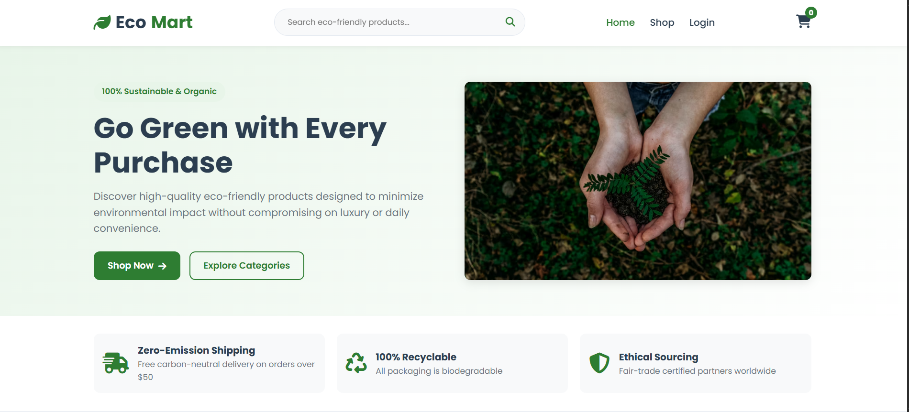
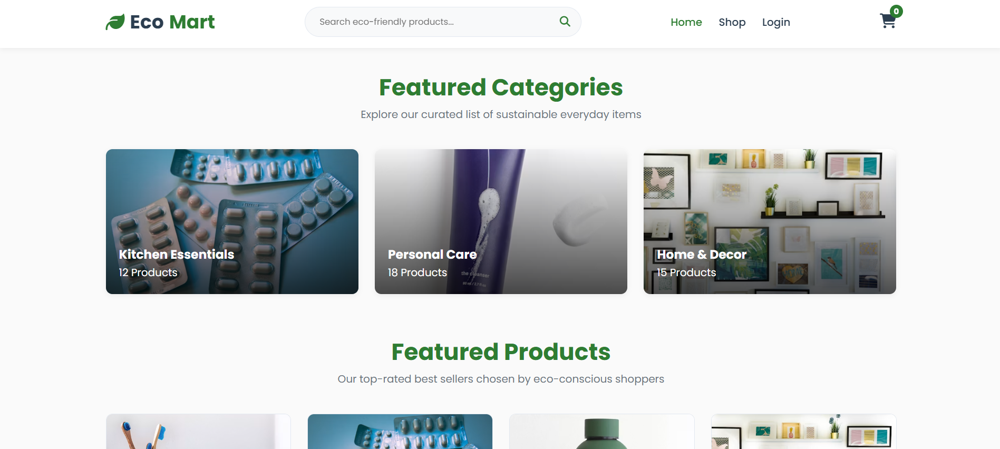
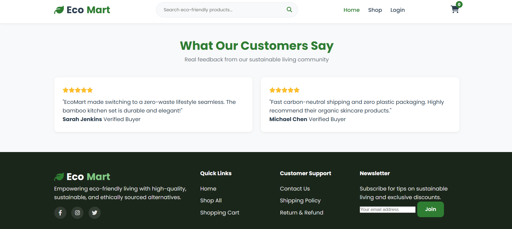
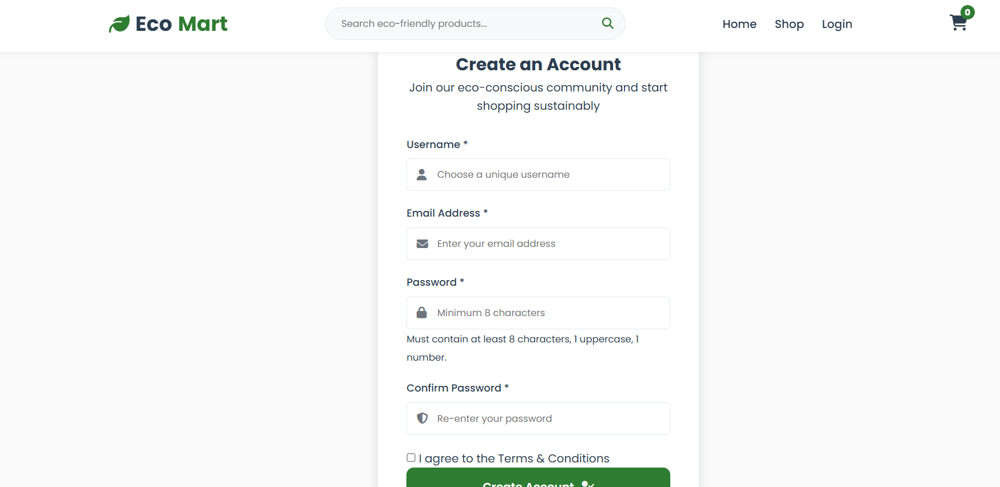
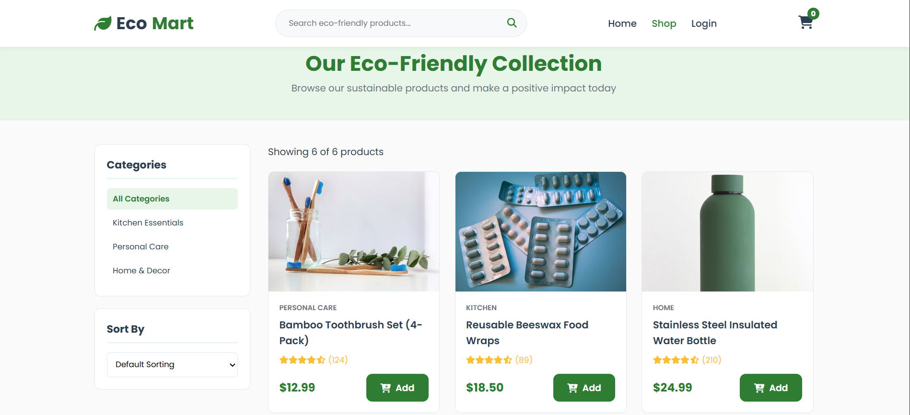
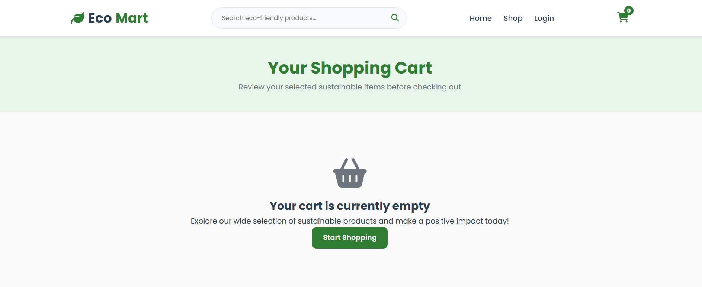

# EcoMart - Full Stack E-commerce Platform

EcoMart is a modern, responsive, and eco-conscious full-stack e-commerce web application built for a university assignment project. It features a complete shopping workflow—including dynamic product browsing, responsive UI, full client-side cart state management, checkout with Cash on Delivery (COD), order persistence, user authentication, and RESTful Django backend APIs connected to an SQLite database.

## Live Demo: https://github.com/nawrin30/CodeAlpha_Simple-E-commerce-Store-EcoMart-/settings/pages 
---
## Dashboard Preview








## 🌿 Features Overview

### 1. Frontend & User Interface
* **Green & White Eco Theme**: Built using clean custom CSS, modern card layouts, hover effects, smooth CSS animations, and Google Fonts (**Poppins**).
* **Fully Responsive**: Mobile-first design principles using flexible grid layouts and media queries (`responsive.css`).
* **Home Page**: Interactive hero banner, value proposition badges, featured categories, client-rendered featured products, customer reviews, and a comprehensive footer.
* **Product Catalog & Filtering**:
  * Category filtering (Kitchen, Personal Care, Home & Decor).
  * Real-time client-side search input filter.
  * Product detail views with image viewports, stock status, and add-to-cart actions.

### 2. E-commerce Core Operations
* **Client-Side Cart Management**:
  * LocalStorage-persisted cart state across page refreshes.
  * Real-time quantity increment/decrement and item removals.
  * Dynamic subtotal, shipping cost, tax, and final amount calculations.
  * Global cart badge count updating automatically across all pages.
* **Checkout Workflow**:
  * Address & customer contact form validation.
  * Cash on Delivery (COD) payment method support.
  * Client-side fallback order generation with unique ID generation (`ECO-XXXXXX`).

### 3. Backend & REST API (Django)
* **User Authentication**: User registration, login/logout endpoints with password validation and session management.
* **Product & Category Management**: Dynamic REST endpoints returning JSON responses for categories, products, and individual item details.
* **Order Processing**: Persists customer orders and individual line items (`OrderItem`) linked to authenticated or guest users.
* **Admin Management Endpoints**: Endpoints allowing administrators to create, update, or delete products, view all customer orders, and list registered users.

---

## 📁 Directory Structure

```text
EcoMart/
│
├── frontend/
│   ├── index.html            # Home page with hero, categories, and reviews
│   ├── products.html         # Shop page with search and category filters
│   ├── product-details.html  # Single product view and related products
│   ├── cart.html             # Cart page with item management and subtotal
│   ├── checkout.html         # Shipping address form and order confirmation
│   ├── login.html            # User login interface
│   └── register.html         # User registration interface
│
├── css/
│   ├── style.css             # Main stylesheet (Theme, Layout, Elements)
│   └── responsive.css        # Responsive media queries (Mobile & Tablet)
│
├── js/
│   ├── app.js                # Product rendering, filter logic, dynamic UI
│   ├── cart.js               # Cart state logic, storage, totals calculation
│   └── auth.js               # Authentication logic and session UI handling
│
└── backend/
    ├── manage.py             # Django management entry script
    ├── backend/
    │   ├── __init__.py
    │   ├── settings.py       # App settings, CORS, REST Framework config
    │   ├── urls.py           # Master URL routing
    │   └── wsgi.py
    └── store/
        ├── __init__.py
        ├── models.py         # Category, Product, Order, OrderItem models
        ├── serializers.py    # Django REST Framework Serializers
        ├── views.py          # Auth, Product, Checkout, and Admin API Views
        └── urls.py           # API endpoint URL patterns